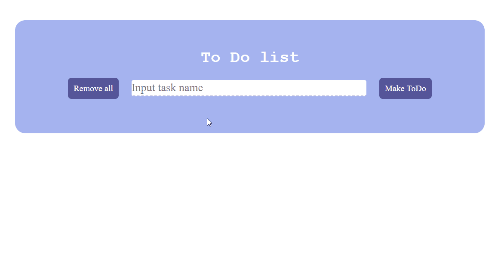

# Angular

This project was generated with [Angular CLI](https://github.com/angular/angular-cli) version 8.3.6.

Simple todo application that make to track tasks and mark then as done.

[web demonstration](http://bychkov.website/)

### Features

- Remove all button deletes all records
- Each task can be marked as done or you can delete it
- Data of changed state of each task saves on localStorage
- Data of tasks goes through localStorage

## Working demo

